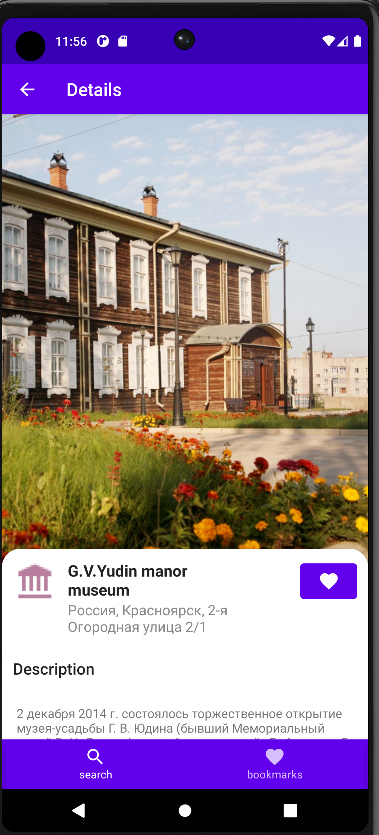

# Build
Для сборки приложения используйте команду (из корневой папки проекта):
```shell
./gradlew assembleDebug
```

Результат сборки находится в:
```shell
Geo/app/build/outputs/apk/debug
```

# Руководство пользователя
## Идея приложения
Основная идея состоит в поиске и сохранении интересных мест во время путешествия, пользователь может
выбирать область поиска, и тип желаемых достопримечательностей, после поиска на карте будут отображены все найденные
места

## Функционал
### Поиск мест


#### Область поиска
При запуске, на главном экране, находится карта и панель управления. На карте расположен полупрозрачный
синий `круг` - это область поиска мест, при перемещении карты область поиска **автоматически 
перемещается** в центр карты. Вы можете изменять ее, используя специальный `слайдер`


#### Категории поиска
Перед поиском, вы должны выбрать `категории поиска`, или достопримечательности, их 4 вида:
- Культурные
- Природные
- Спортивные
- Рестораны или кафе


#### Поиск
По завершению настройки параметров поиска, вы можете нажать на кнопку поиска `Search`, в результате чего на
карту будут нанесены интересные места


Обозначения цветов маркеров:
- **Красный**: Культурные достопримечательности
- **Желтый**: Рестораны или кафе
- **Зеленый**: Природные достопримечательности
- **Синий**: Спортивные достопримечательности

#### Очистка мест
Для очистки найденных мест необходимо нажать на кнопку `корзины` 
в правом верхнем углу карты

#### Скрыть область поиска
Чтобы скрыть область поиска необходимо нажать на кнопку `глаза`
в правом верхнем углу карты


### Детальный просмотр места
Чтобы получить подробную информацию о месте, необходимо нажать
на его маркер. В результате чего откроется окно детального просмотра


#### Добавление в избранное
Чтобы добавить место в избранное, необходимо нажать на `кнопку
с иконкой сердца` в окне детального просмотра, в результате чего
данное место добавиться в `заметки`

### Заметки
Вы можете открыть заметки, нажав на кнопку `bookmarks` справа внизу
Заметки можно удалить из списка, нажав на кнопку `корзины`, а так
же просмотреть их детально, нажав на нее


# Идея монетизации
Монетизировать приложение можно при помощи ограничения количества
заметок, и убирать ограничение при покупке платной версии

# Публикация приложения
Приложение планируется публиковать в [RuStore](https://www.rustore.ru/)
